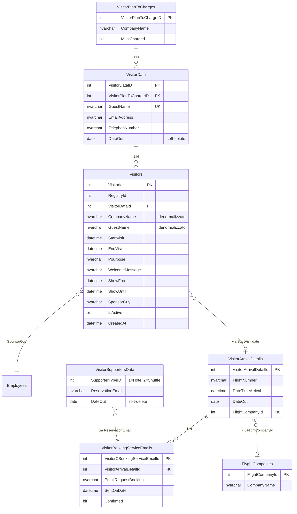
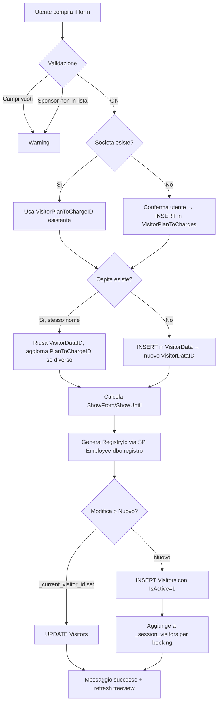
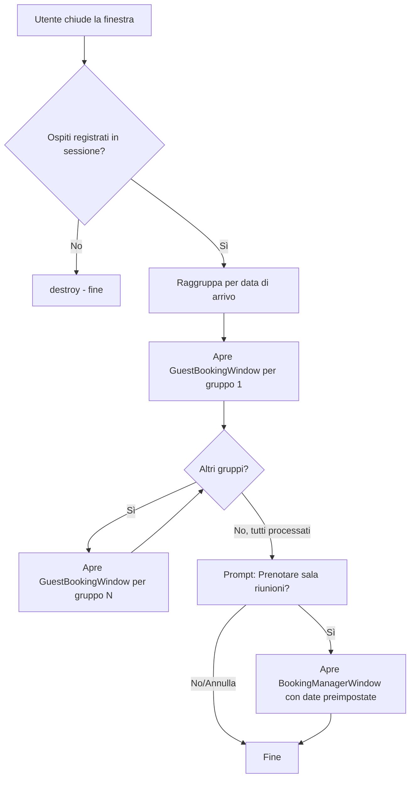

# Guest Management — Logica Completa

## 1. Punti di Ingresso (main.py)

Tutte le funzioni richiedono autenticazione via [_execute_authorized_action](file:///c:/Users/gtesta/PythonProjetcs/Python/PrductionDocumentation/main.py#14514-14620) (menu `manage_guests`):

| Metodo main.py | Modulo | Classe | Descrizione |
|---|---|---|---|
| [open_guest_registration_with_login](file:///c:/Users/gtesta/PythonProjetcs/Python/PrductionDocumentation/main.py#17341-17348) | `guests_gui` | [GuestRegistrationWindow](file:///c:/Users/gtesta/PythonProjetcs/Python/PrductionDocumentation/guests_gui.py#18-1301) | Registrazione nuovi visitatori |
| [open_guest_management_with_login](file:///c:/Users/gtesta/PythonProjetcs/Python/PrductionDocumentation/main.py#17362-17370) | `guest_management_gui` | [GuestManagementWindow](file:///c:/Users/gtesta/PythonProjetcs/Python/PrductionDocumentation/guest_management_gui.py#16-741) | Gestione booking e dati ospiti |
| [open_hotel_settings_with_login](file:///c:/Users/gtesta/PythonProjetcs/Python/PrductionDocumentation/main.py#17371-17381) | `guest_settings_gui` | `SupporterSettingsWindow(type=1)` | CRUD Hotels |
| [open_shuttle_settings_with_login](file:///c:/Users/gtesta/PythonProjetcs/Python/PrductionDocumentation/main.py#17382-17392) | `guest_settings_gui` | `SupporterSettingsWindow(type=2)` | CRUD Shuttle |
| [open_airline_settings_with_login](file:///c:/Users/gtesta/PythonProjetcs/Python/PrductionDocumentation/main.py#17393-17401) | `guest_settings_gui` | `AirlineSettingsWindow` | CRUD Compagnie Aeree |
| [open_guest_rules_with_login](file:///c:/Users/gtesta/PythonProjetcs/Python/PrductionDocumentation/main.py#17402-17410) | `guest_rules_gui` | `GuestRulesWindow` | Regole ospiti |

---

## 2. Tabelle Database (Employee.dbo)



### Ruolo delle tabelle

| Tabella | Ruolo |
|---|---|
| **VisitorPlanToCharges** | Anagrafica società (chi paga). Ogni società ha un `CompanyName` univoco |
| **VisitorData** | Anagrafica ospiti. `GuestName` è univoco (indice). Collegato a società via FK |
| **Visitors** | Registro visite. Ogni riga = 1 visita di 1 ospite. Denormalizza company/guest per performance |
| **VisitorArrivalDetails** | Dettagli arrivo (volo, data/ora arrivo, data partenza). Collegato a booking |
| **VisitorBookingServiceEmails** | Tracking email di prenotazione (hotel/shuttle). Flag `Confirmed` |
| **VisitorSupportersData** | Anagrafica fornitori servizi: Hotels (type=1) e Shuttle (type=2) con email prenotazione |
| **FlyghtCompanies** | Anagrafica compagnie aeree |
| **Employees/EmployeeAddress/EmployeeHireHistory** | Fonte dati per la lista "Sponsor" (dipendenti attivi con `EmployeeRId=2`) |

---

## 3. Flusso Registrazione Ospite ([guests_gui.py](file:///c:/Users/gtesta/PythonProjetcs/Python/PrductionDocumentation/guests_gui.py))

### 3.1 Apertura Form

```
main.py → _execute_authorized_action('manage_guests')
        → GuestRegistrationWindow(parent, db, lang, user_name)
```

All'init:
1. Carica **società** da `VisitorPlanToCharges` → combobox con filtro live
2. Carica **sponsor** da `Employees` (JOIN `EmployeeAddress` + `EmployeeHireHistory`, solo attivi `EndWorkDate IS NULL`, `EmployeeRId=2`)
3. Carica **visitatori recenti** dal `Visitors` filtrati per data odierna

### 3.2 Salvataggio ([_on_save](file:///c:/Users/gtesta/PythonProjetcs/Python/PrductionDocumentation/main.py#9336-9383))



**Dettagli chiave:**
- **ShowFrom** = `start_visit 08:30`, **ShowUntil** = `end_visit 17:00` (orari display su kiosk)
- **RegistryId** generato dalla SP `Employee.dbo.registro` con `RegistryTypeId=930`
- Il nome ospite è salvato in **MAIUSCOLO** (`guest.strip().upper()`)
- Dopo il salvataggio, il treeview si filtra automaticamente alla data di arrivo dell'ospite e lo evidenzia

### 3.3 Chiusura Form ([_on_close](file:///c:/Users/gtesta/PythonProjetcs/Python/PrductionDocumentation/guests_gui.py#530-562))



**Note:**
- I booking vengono aperti **sequenzialmente** tramite `on_close_callback` (ogni chiusura apre il prossimo gruppo)
- Il dialog di prenotazione sala preimposta le date dello sponsor e orari 09:00-17:00

---

## 4. Gestione Ospiti ([guest_management_gui.py](file:///c:/Users/gtesta/PythonProjetcs/Python/PrductionDocumentation/guest_management_gui.py))

### 4.1 Apertura

```
main.py → _execute_authorized_action('manage_guests')
        → GuestManagementWindow(parent, db, lang, user_name)
```

Finestra con 2 tab:

### 4.2 Tab 1 — 📋 Booking

**Scopo:** Audit e gestione delle prenotazioni (hotel/shuttle) inviate via email.

**Query principale:** JOIN tra `VisitorBookingServiceEmails`, `VisitorArrivalDetails`, `FlyghtCompanies`. Il tipo di servizio (Hotel/Shuttle) viene determinato da `VisitorSupportersData.SupporterTypeID`.

**Azioni disponibili:**

| Azione | Cosa fa |
|---|---|
| ✅ Segna Confermato | `UPDATE VisitorBookingServiceEmails SET Confirmed=1` |
| 📧 Reinvia Email | Reinvia email HTML con dettagli volo/arrivo/partenza + avviso conferma bilingue (RO/EN) |
| ➕ Genera Booking | Trova ospiti attivi SENZA booking → selezione → apre `GuestBookingWindow` sequenziale |
| 🔄 Aggiorna | Ricarica la lista |
| ☐ Mostra confermati | Checkbox per includere anche booking già confermati |

**Genera Booking:** Query trova ospiti con `EndVisit >= oggi` che NON compaiono in nessun `VisitorBookingServiceEmails` → dialog di selezione con checkbox → gruppa per data arrivo → apre `GuestBookingWindow` in sequenza.

### 4.3 Tab 2 — 👤 Dati Ospiti

**Scopo:** Manutenzione anagrafica ospiti (email, telefono).

**Dati:** `VisitorData` LEFT JOIN `VisitorPlanToCharges`, filtrabili per società.

| Azione | Cosa fa |
|---|---|
| Seleziona ospite | Popola campi email + telefono |
| 💾 Salva | `UPDATE VisitorData SET EmailAddress=?, TelephonNumber=?` |
| Filtra per società | Combobox → ricarica lista filtrata per `VisitorPlanToChargeID` |

---

## 5. Flusso Completo End-to-End

```
1. REGISTRAZIONE
   └─ Utente apre "Registrazione Ospiti" (menu)
   └─ Seleziona/crea società (VisitorPlanToCharges)
   └─ Seleziona/crea ospite (VisitorData)
   └─ Compila date, motivo, sponsor
   └─ Salva → INSERT in Visitors (+ genera RegistryId via SP)
   └─ Ospite aggiunto a _session_visitors

2. CHIUSURA FORM
   └─ Raggruppa ospiti per data arrivo
   └─ Per ogni gruppo → apre GuestBookingWindow
       └─ Utente configura volo, hotel, shuttle
       └─ Sistema invia email prenotazione
       └─ Registra in VisitorBookingServiceEmails
   └─ Prompt sala riunioni → BookingManagerWindow

3. GESTIONE (post-registrazione)
   └─ Tab Booking: audit conferme, reinvio email
   └─ Tab Dati Ospiti: aggiorna email/telefono in VisitorData
   └─ Genera Booking: per ospiti senza prenotazione
```
