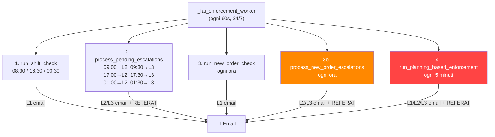

# Analisi Bug: FAI Enforcement — Escalation L3 invia troppe email

## Problema Segnalato

Il sistema invia **moltissime email** con titolo *"FAI Enforcement - Escalation Livello 3"* che **non seguono la logica desiderata**. Solo i template FAI con il campo `Autocheck = 1` nella tabella `traceability_rs.fai.FaiTemplates` devono attivare la logica di escalation.

---

## Analisi Root-Cause

Dopo un'analisi approfondita di tutto il codice (`fai_enforcement.py`, `fai_autocheck.py`, `main.py` worker), ho identificato **3 fonti di escalation indipendenti** che girano in parallelo, alcune con problemi critici:

### Architettura attuale — 3 motori di escalation



---

## 🔴 BUG CRITICI IDENTIFICATI

### BUG 1: `process_new_order_escalations` — Nessun gate temporale

[fai_enforcement.py:L1385-L1451](file:///c:/Users/gtesta/PythonProjetcs/Python/PrductionDocumentation/fai_enforcement.py#L1385-L1451)

```python
def process_new_order_escalations(conn, logo_path="logo.png"):
    """Processa escalation per nuovi ordini senza FAI."""
    now = datetime.now()
    employees = get_responsible_employees(conn)
    admin_info = get_administrator_info(conn)

    # Check L1→L2 (eventi di 30+ min fa)  ← IL COMMENTO DICE 30+ MIN MA NON C'È NESSUN CONTROLLO TEMPORALE!
    for target_level in [2, 3]:
        source_level = target_level - 1
        pending = get_pending_escalations(conn, 'NEW_ORDER', source_level)  # ← NESSUN shift_time!
        ...
```

> [!CAUTION]
> **Questo metodo viene chiamato ogni ora** dal worker (`main.py:11481`), ma **non ha nessun gate temporale**.
> Non verifica se è passato abbastanza tempo prima di escalare da L1→L2→L3.
> 
> Risultato: **alla prima esecuzione dopo la creazione di un evento L1, il sistema tenta immediatamente L1→L2 e poi L2→L3 nello stesso ciclo**, perché itera `for target_level in [2, 3]` senza alcun delay.
> 
> L'unica protezione è `check_already_escalated`, ma **la L2 viene creata nel loop e poi il loop stesso prova la L3** — potenzialmente nello stesso ciclo!

### BUG 2: `run_planning_based_enforcement` — Escalation diretta a qualsiasi livello ogni 5 minuti

[fai_enforcement.py:L1612-L1716](file:///c:/Users/gtesta/PythonProjetcs/Python/PrductionDocumentation/fai_enforcement.py#L1612-L1716)

```python
def run_planning_based_enforcement(conn, logo_path="logo.png"):
    ...
    violations = get_planning_violations(conn)  # Determina il livello in base al tempo
    ...
    for v in violations:
        level = v['current_level']  # Può essere 1, 2 o 3 DIRETTAMENTE
        
        # Anti-duplicazione: controlla se già inviata escalation per questo livello
        if check_already_escalated(conn, 'PLANNING_CHECK', order_id=order_id, level=level):
            continue
        
        # Invia email AL LIVELLO DETERMINATO — potenzialmente L3 diretta!
        send_escalation_email(level=level, ...)
```

> [!WARNING]  
> Questo metodo gira **ogni 5 minuti** (`main.py:11491-11496`). Per ogni ordine il cui `PlannedStart` è passato (livello = 3 da `determine_planning_escalation_level`), invia **direttamente una email L3** senza mai aver inviato L1 e L2.
> 
> Inoltre, `check_already_escalated` usa `EventType = 'PLANNING_CHECK'`, ma i livelli L1 e L2 del **SHIFT_CHECK** e del **NEW_ORDER** sono registrati con `EventType` diversi — quindi non rileva che un L1 è già stato inviato da un altro flusso per lo stesso ordine.

### BUG 3: Sovrapposizione dei 3 sistemi sullo stesso ordine

Lo stesso ordine può attivare **tutte e 3 le pipeline** contemporaneamente:

| Pipeline | EventType | Trigger | Frequenza |
|----------|-----------|---------|-----------|
| Shift Check | `SHIFT_CHECK` | Inizio turno + 60min | 3 volte/giorno |
| New Order | `NEW_ORDER` | Ordine scannato nell'ultima ora | Ogni ora |
| Planning-Based | `PLANNING_CHECK` | PlannedStart - 3h dal file Excel | **Ogni 5 minuti** |

> [!CAUTION]
> Ogni pipeline usa un `EventType` diverso, quindi l'anti-duplicazione **non funziona cross-pipeline**. Un ordine con FAI mancante riceve potenzialmente **3 catene di escalation parallele**, ciascuna con L1, L2 e L3 = **fino a 9 email** per lo stesso ordine!

### BUG 4: Planning-Based — `check_already_escalated` con `order_id = None`

[fai_enforcement.py:L1648](file:///c:/Users/gtesta/PythonProjetcs/Python/PrductionDocumentation/fai_enforcement.py#L1644-L1653)

```python
order_id = _resolve_order_id(conn, order_number)  # Può tornare None!

if check_already_escalated(conn, 'PLANNING_CHECK', order_id=order_id, level=level):
    continue
```

E in `check_already_escalated`:
```python
if order_id:           # ← Se order_id è None, questa condizione è FALSE
    query += " AND OrderId = ?"
    params.append(order_id)
```

> [!CAUTION]
> Se `_resolve_order_id` ritorna `None` (ordine non ancora nel DB, solo nel file Excel), il check anti-duplicazione **non filtra per ordine** — cerca qualsiasi evento `PLANNING_CHECK` al livello dato per la data odierna. Ma il `log_enforcement_event` successivo (`L1699`) registra con `order_id=None` e `order_number=order_number`. 
> 
> Al prossimo ciclo (5 minuti dopo), se c'è un **altro** ordine con `order_id=None`, l'anti-duplicazione lo trova e lo blocca erroneamente. Ma se il primo ordine ora ha un `order_id` valido, non viene più trovato e viene re-inviato!

---

## Riepilogo dei Punti Critici

| # | Bug | Impatto | Severità |
|---|-----|---------|----------|
| 1 | `process_new_order_escalations` senza delay temporale | L1→L2→L3 nello stesso ciclo | 🔴 Critico |
| 2 | `run_planning_based_enforcement` invia L3 diretta | L3 senza L1/L2 precedenti, ogni 5min | 🔴 Critico |
| 3 | 3 pipeline parallele per lo stesso ordine | Fino a 9 email per ordine | 🔴 Critico |
| 4 | `order_id = None` rompe l'anti-duplicazione | Email duplicate o bloccate erroneamente | 🟠 Alto |

---

## Proposta di Fix

### Principio fondamentale

> **Un solo sistema di enforcement per tipo di evento**, con una logica chiara e lineare.

### Proposta: Unificare in 2 sole pipeline

1. **SHIFT_CHECK** — Per dipendenti presenti che non compilano FAI ad inizio turno
   - Gate temporali rigidi (come ora: `should_check_shift` + `should_escalate`)
   - ✅ Già funzionante correttamente

2. **ORDER_CHECK** — Per ordini con template `Autocheck=1` senza FAI compilato
   - **Eliminare** `run_new_order_check` + `process_new_order_escalations` (basato su scannings recenti)
   - **Mantenere solo** `run_planning_based_enforcement` (basato su Excel Planning)
   - **Aggiungere gate temporali**: L1 solo se non già inviato, L2 solo 30+ min dopo L1, L3 solo 30+ min dopo L2
   - **Aggiungere anti-duplicazione cross-pipeline**: prima di inviare qualsiasi email L3, verificare se già esiste un evento di qualsiasi `EventType` per lo stesso `OrderNumber` + livello

### Modifiche specifiche ai file

---

### Componente: fai_enforcement.py

#### [MODIFY] [fai_enforcement.py](file:///c:/Users/gtesta/PythonProjetcs/Python/PrductionDocumentation/fai_enforcement.py)

1. **`run_planning_based_enforcement`** — Aggiungere logica di escalation progressiva:
   - Se `current_level == 1`: invia L1 solo se non esiste già un evento per questo ordine a qualsiasi livello
   - Se `current_level == 2`: invia L2 solo se esiste un L1 da almeno 30 minuti
   - Se `current_level == 3`: invia L3 solo se esiste un L2 da almeno 30 minuti
   - Anti-duplicazione: usare `OrderNumber` (non `OrderId`) come chiave, più affidabile

2. **`process_new_order_escalations`** — Rimuovere o disabilitare completamente
   - È ridondante con `run_planning_based_enforcement`
   - Causa email L3 senza delay

3. **`run_new_order_check`** — Rimuovere o disabilitare
   - È ridondante con il planning-based enforcement
   - Invia L1 per ordini che poi vengono ri-escalati dal planning

4. **`check_already_escalated`** — Aggiungere ricerca anche per `OrderNumber` come fallback quando `OrderId` è None

5. **Nuova funzione `check_escalation_timing`** — Verifica che sia passato abbastanza tempo dal livello precedente prima di escalare

---

### Componente: main.py (worker)

#### [MODIFY] [main.py](file:///c:/Users/gtesta/PythonProjetcs/Python/PrductionDocumentation/main.py)

1. **`_fai_enforcement_worker`** (L11452-L11501):
   - Rimuovere le chiamate a `run_new_order_check` e `process_new_order_escalations`
   - Mantenere solo `run_shift_check`, `process_pending_escalations`, e `run_planning_based_enforcement`
   - Cambiare l'intervallo del planning-based da 5 min a **15 min** (riduce il rischio di spam)

---

## Verification Plan

### Automated Tests
- Controllare log `FAI Enforcement` dopo deploy per verificare che non si generino email L3 senza L1/L2 precedenti
- Verificare nel DB: `SELECT * FROM fai.FaiEnforcementLog WHERE CheckDate = CAST(GETDATE() AS DATE) ORDER BY DateIn` — non devono esserci record L3 senza L1 e L2 precedenti per lo stesso ordine

### Manual Verification
- Monitorare email in arrivo per 1 turno completo (8h) dopo il deploy
- Verificare che un ordine Autocheck=1 generi **massimo 3 email** (L1, L2, L3) con intervalli di almeno 30 minuti

---

## Open Questions

> [!IMPORTANT]
> 1. **Vuoi eliminare completamente `NEW_ORDER` check** (basato su scannings recenti) e tenere solo il planning-based, o preferisci tenerli entrambi ma con deduplicazione cross-pipeline?
> 2. **Intervallo minimo tra livelli di escalation**: confermo 30 minuti tra L1→L2 e L2→L3, o preferisci un intervallo diverso?
> 3. **L'intervallo di 5 minuti per il planning-based** è intenzionale? Posso portarlo a 15 minuti per ridurre il rischio di email duplicate in caso di race condition.
