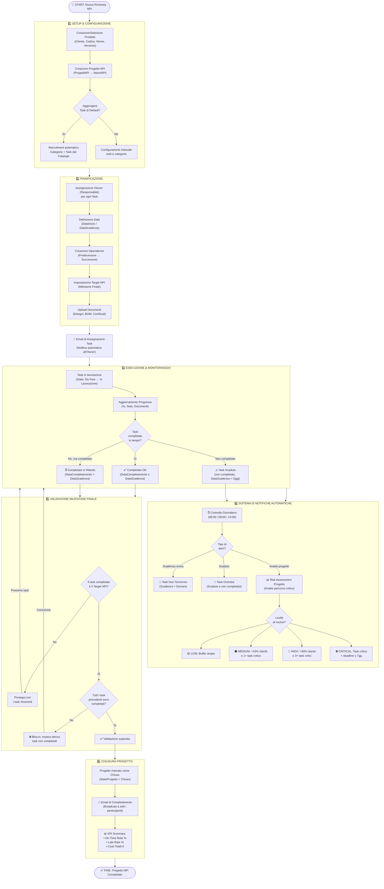
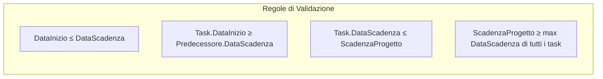
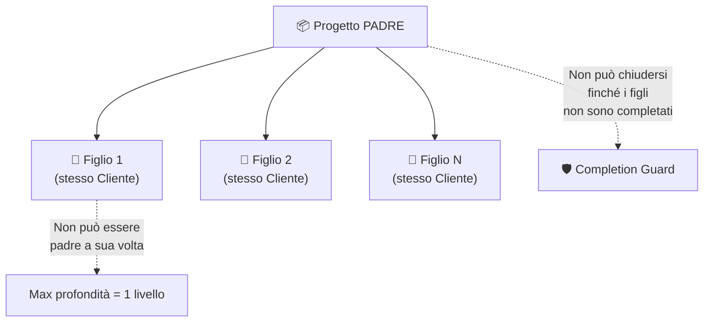

# Flusso Logico del Processo NPI (New Product Introduction)

Diagramma completo del ciclo di vita di un progetto NPI nel sistema TraceabilityRS.

---

## Diagramma di Flusso Generale

---

## Flusso Dipendenze e Validazione Date

---

## Flusso Gerarchia Progetti (Parent/Child)

---

## Riepilogo Fasi del Processo

| # | Fase | Attori | Output |
|:--|:-----|:-------|:-------|
| 1 | **Setup** | Project Owner | Progetto NPI + Wave + Task da catalogo |
| 2 | **Pianificazione** | Project Owner | Date, dipendenze, milestone, documenti |
| 3 | **Esecuzione** | Task Owners | Avanzamento task, upload documenti |
| 4 | **Monitoraggio** | Sistema automatico | Email alert (scadenze, ritardi, rischi) |
| 5 | **Validazione** | Sistema | Controllo sequenziale milestone |
| 6 | **Chiusura** | Sistema + Project Owner | KPI report, email broadcast, archiviazione |

---

## Attori e Ruoli

| Ruolo | Responsabilità |
|:------|:---------------|
| **Project Owner** | Crea progetto, assegna task, gestisce gerarchia, chiude progetto |
| **Task Owner** | Esegue task assegnati, aggiorna stato e documenti |
| **Sistema (Background)** | Notifiche automatiche, risk assessment, validazione milestone |
| **Admin** | Configurazione catalogo, categorie di default, gestione soggetti |

---

## Componenti Software Coinvolti

| Componente | File | Ruolo |
|:-----------|:-----|:------|
| Dashboard | `dashboard_window.py` | Vista globale progetti + KPI |
| Gestione Progetto | `project_window.py` | Task, documenti, metadata |
| Gantt | `gantt_window.py` | Visualizzazione timeline |
| Backend NPI | [npi_manager.py](file:///c:/Users/gtesta/PythonProjetcs/Python/PrductionDocumentation/npi/npi_manager.py) | Logica business, validazione, sorting |
| Notifiche Auto | [npi_auto_notifications.py](file:///c:/Users/gtesta/PythonProjetcs/Python/PrductionDocumentation/npi/npi_auto_notifications.py) | Risk assessment, email giornaliere |
| Notifiche Task | [notification_manager.py](file:///c:/Users/gtesta/PythonProjetcs/Python/PrductionDocumentation/npi/notification_manager.py) | Alert scadenze singoli task |
| Configurazione | `config_window.py` | Catalogo, categorie, default |
