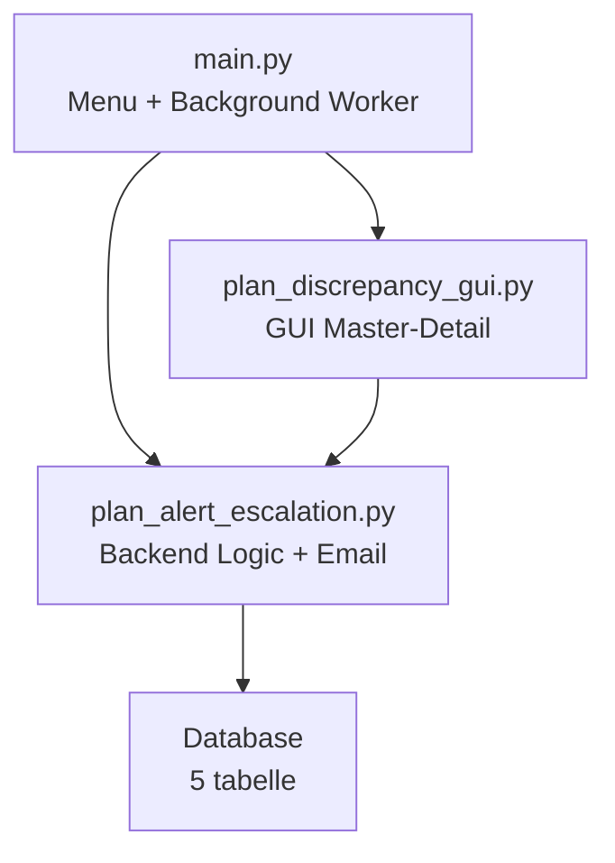
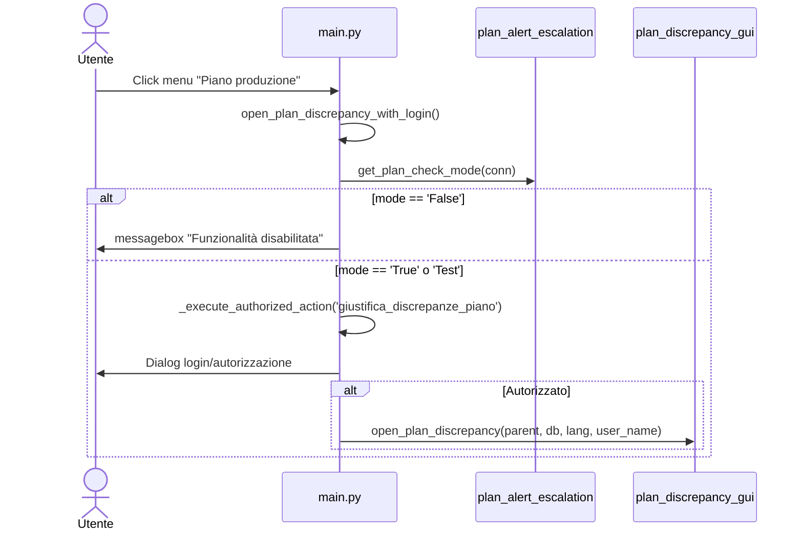
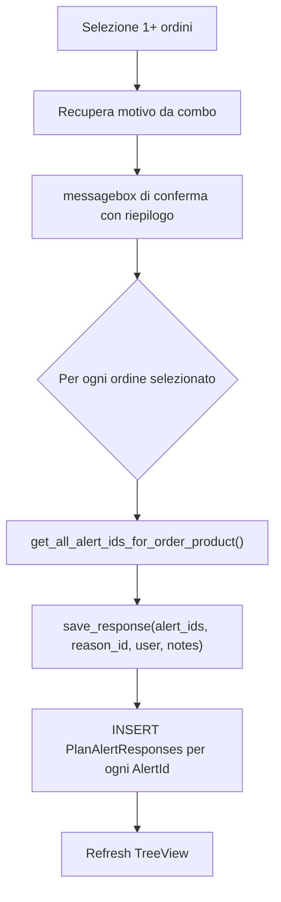
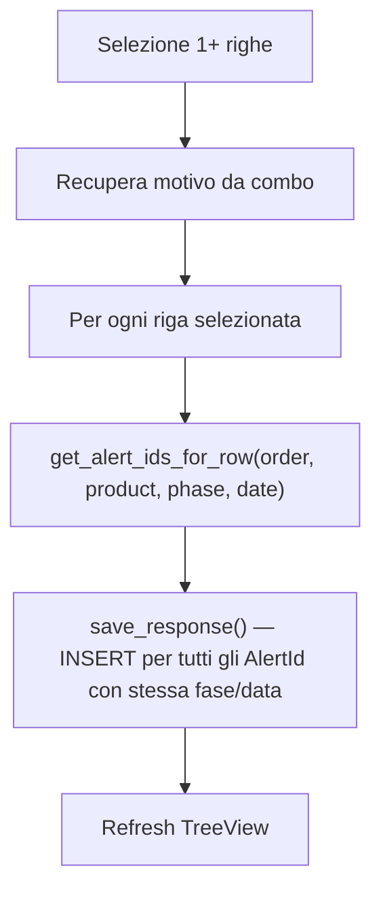
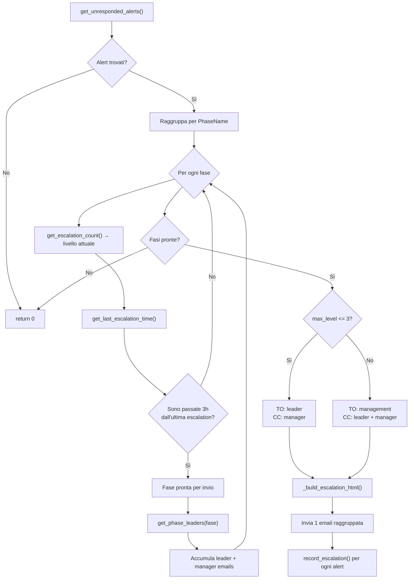
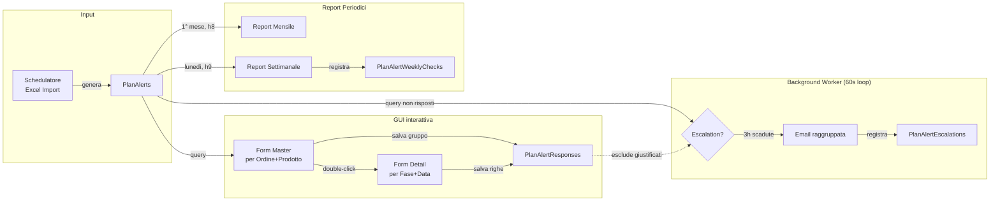

# Modulo Discrepanze Piano Produzione — Quadro Completo

## Architettura Generale

Il modulo è composto da **3 layer** distribuiti su **4 file**:



| File | Righe | Responsabilità |
|------|-------|----------------|
| [main.py](file:///c:/Users/gtesta/PythonProjetcs/Python/PrductionDocumentation/main.py) | ~80 righe dedicate | Entry point menu, feature flag, background worker thread |
| [plan_discrepancy_gui.py](file:///c:/Users/gtesta/PythonProjetcs/Python/PrductionDocumentation/plan_discrepancy_gui.py) | 661 | GUI Tkinter master-detail per giustificazione interattiva |
| [plan_alert_escalation.py](file:///c:/Users/gtesta/PythonProjetcs/Python/PrductionDocumentation/plan_alert_escalation.py) | 1260 | Query SQL, escalation email, report mensile/settimanale |
| [plan_discrepancy_schema.sql](file:///c:/Users/gtesta/PythonProjetcs/Python/PrductionDocumentation/plan_discrepancy_schema.sql) | 134 | Creazione schema DB |

---

## 1. Feature Flag e Accesso

### Setting: `Sys_enable_control_plan_check`

Letto dalla tabella `traceability_rs.dbo.settings` tramite [get_plan_check_mode()](file:///c:/Users/gtesta/PythonProjetcs/Python/PrductionDocumentation/plan_alert_escalation.py#L23-L46).

| Valore | Effetto |
|--------|---------|
| `'False'` | Tutto disabilitato: menu nascosto, worker non avviato |
| `'True'` | Attivo in produzione: email ai destinatari reali |
| `'Test'` | Attivo ma email reindirizzate a `gianluca.testa@vandewiele.com` |

### Flusso di accesso all'apertura



> [!NOTE]
> Il menu "Piano produzione" viene aggiunto al menu `declarations_submenu` **solo se** `_plan_check_mode != 'False'` al momento della costruzione dei menu ([main.py:15493](file:///c:/Users/gtesta/PythonProjetcs/Python/PrductionDocumentation/main.py#L15493-L15497)).

---

## 2. Schema Database (5 tabelle)

Definito in [plan_discrepancy_schema.sql](file:///c:/Users/gtesta/PythonProjetcs/Python/PrductionDocumentation/plan_discrepancy_schema.sql).

### 2.1 `PlanAlerts` (tabella esterna, pre-esistente)
Contiene gli alert generati automaticamente dal sistema di controllo piano produzione.

| Colonna | Tipo | Note |
|---------|------|------|
| `AlertId` | INT PK | ID univoco alert |
| `IdOrder` | INT | FK → Orders.IDOrder |
| `ProductName` | NVARCHAR | Nome prodotto |
| `PhaseName` | NVARCHAR | Fase di produzione (SMT, PTHM, ICT, ...) |
| `QtyInXls` | INT | Quantità pianificata (da Excel) |
| `QtyProduced` | INT | Quantità effettivamente prodotta |
| `QtyExpected` | INT | Quantità attesa a questo punto |
| `ProjectedEnd` | DATE | Data fine proiettata |
| `Deficit` | INT | QtyExpected - QtyProduced |
| `StatusColor` | VARCHAR | `'red'` (ritardo) o `'out_of_plan'` (fuori piano) |
| `AlertDate` | DATETIME | Data/ora generazione alert |
| `OnFuture` | BIT | Se l'alert riguarda una data futura |

### 2.2 `PlanRespect` — Motivazioni predefinite
| Colonna | Tipo |
|---------|------|
| `PlanResponseId` | SMALLINT IDENTITY PK |
| `ResponseDescription` | NVARCHAR(200) |
| `IsActive` | BIT (default 1) |
| `DateIn` | DATETIME |

**10 motivazioni iniziali**: Eroare de planificare, Lipsă material, Defecțiune mașină, Probleme calitate, Lipsă personal, Modificare prioritate client, Întârziere furnizor, Ciclu de producție incorect, Reprogramare producție, Altele.

### 2.3 `PlanAlertResponses` — Giustificazioni operatore
| Colonna | Tipo | Note |
|---------|------|------|
| `AlertResponseId` | INT IDENTITY PK | |
| `AlertId` | INT NOT NULL | FK → PlanAlerts.AlertId |
| `PlanResponseId` | SMALLINT | FK → PlanRespect.PlanResponseId |
| `Operator` | NVARCHAR(100) | Nome utente loggato |
| `ResponseDate` | DATETIME | GETDATE() |
| `Notes` | NVARCHAR(500) | Note libere opzionali |

### 2.4 `PlanAlertEscalations` — Tracking email inviate
| Colonna | Tipo |
|---------|------|
| `EscalationId` | INT IDENTITY PK |
| `AlertId` | INT NOT NULL |
| `EscalationLevel` | SMALLINT (default 1) |
| `SentDate` | DATETIME |
| `Recipients` | NVARCHAR(500) |
| `PhaseName` | NVARCHAR(100) |

### 2.5 `PlanAlertWeeklyChecks` — Tracking pattern ricorrenti
| Colonna | Tipo |
|---------|------|
| `WeeklyCheckId` | INT IDENTITY PK |
| `CheckDate` | DATETIME |
| `ProductName` | NVARCHAR(200) |
| `PhaseName` | NVARCHAR(100) |
| `OccurrenceCount` | INT |

---

## 3. GUI — Form Master-Detail

### 3.1 Form Master: `PlanDiscrepancyWindow`
[plan_discrepancy_gui.py:28-391](file:///c:/Users/gtesta/PythonProjetcs/Python/PrductionDocumentation/plan_discrepancy_gui.py#L28-L391)

**Scopo**: Riepilogo discrepanze raggruppate per **Ordine + Prodotto**.

#### Layout

```
┌─────────────────────────────────────────────────┐
│ Operator: [user_name]               ⏱ 60:00    │  ← Header
├─────────────────────────────────────────────────┤
│ 🔄 Actualizare  |  "Dbl-click..."  | 35 orders │  ← Toolbar
├─────────────────────────────────────────────────┤
│ Order | Product | Nr.Disc | 🔴 | 🟠 | Deficit  │
│       | (sfondo rosso = has_red)                │  ← TreeView Master
│       | (sfondo arancione = only_out)           │
│       |         | Phases | First | Last Alert   │
├─────────────────────────────────────────────────┤
│ 📝 Giustificazione a livello di ordine          │
│ Motivație: [combo]  Note: [___]  ✅ Salvează    │  ← Justify Group
├─────────────────────────────────────────────────┤
│                        🔍 Detalii  | Închide    │  ← Footer
└─────────────────────────────────────────────────┘
```

#### Colonne TreeView Master (9 colonne)

| Colonna | Label | Larghezza | Allineamento |
|---------|-------|-----------|-------------|
| `order` | Order | 100 | center |
| `product` | Product | 220 | left |
| `total` | Nr. Discrepancies | 100 | center |
| `red` | 🔴 Delay | 90 | center |
| `out_of_plan` | 🟠 Out of Plan | 90 | center |
| `deficit` | Total Deficit | 90 | center |
| `phases` | Phases | 180 | left |
| `first_date` | First Alert | 90 | center |
| `last_date` | Last Alert | 90 | center |

#### Funzionalità Form Master

| Feature | Descrizione |
|---------|-------------|
| **Pulizia duplicati automatica** | All'apertura chiama `cleanup_duplicate_alerts()` per eliminare record duplicati dalla tabella PlanAlerts |
| **Timer 60 minuti** | Countdown da 60:00 con colori: blu (>15min), arancione (5-15min), rosso (<5min), poi "EXPIRED!" |
| **Double-click → Dettaglio** | Apre `PlanDetailWindow` per l'ordine+prodotto selezionato |
| **Giustificazione GROUP** | Seleziona 1+ ordini, motivo da combo, note, salva per TUTTI gli alert dell'ordine |
| **Selezione multipla** | `selectmode='extended'` — Ctrl+click per selezionare più ordini |
| **Conferma chiusura** | Se ci sono ancora ordini non giustificati, chiede conferma prima di chiudere |
| **Refresh** | Pulsante 🔄 per ricaricare i dati |

#### Query dati Master
Chiama [get_unresponded_alerts_summary()](file:///c:/Users/gtesta/PythonProjetcs/Python/PrductionDocumentation/plan_alert_escalation.py#L118-L172) che raggruppa per `OrderNumber + ProductName`:
- COUNT DISTINCT per `PhaseName|AlertDate` come TotalAlerts
- SUM StatusColor='red' come RedCount
- STUFF/FOR XML per lista fasi distinte
- Esclude alert per cui esiste già una risposta nella **stessa data** (sottoquery NOT EXISTS)

---

### 3.2 Form Detail: `PlanDetailWindow`
[plan_discrepancy_gui.py:398-655](file:///c:/Users/gtesta/PythonProjetcs/Python/PrductionDocumentation/plan_discrepancy_gui.py#L398-L655)

**Scopo**: Tutte le righe analitiche per un ordine+prodotto specifico.

#### Layout

```
┌─────────────────────────────────────────────────┐
│ Order: [num]  |  Product: [name]     5 alerts   │  ← Header
├─────────────────────────────────────────────────┤
│ ☑ Selectează tot | ☐ Deselectează tot            │  ← Toolbar
├─────────────────────────────────────────────────┤
│ Phase|Qty Plan|Qty Prod|Qty Exp|Deficit|Status  │
│      |Alert Date|Projected End|Future           │  ← TreeView Detail
│ (sfondo rosso/arancione per status)             │
├─────────────────────────────────────────────────┤
│ 📝 Giustificazione a livello di riga            │
│ Motivație: [combo]  Note: [___]  ✅ Salvează    │  ← Justify Row
├─────────────────────────────────────────────────┤
│                                      Închide    │  ← Footer
└─────────────────────────────────────────────────┘
```

#### Colonne TreeView Detail (9 colonne)

| Colonna | Label | Larghezza |
|---------|-------|-----------|
| `phase` | Phase | 130 |
| `qty_xls` | Qty Plan | 80 |
| `qty_produced` | Qty Produced | 80 |
| `qty_expected` | Qty Expected | 80 |
| `deficit` | Deficit | 70 |
| `status` | Status | 90 |
| `alert_date` | Alert Date | 100 |
| `projected_end` | Projected End | 100 |
| `on_future` | Future | 60 |

#### Funzionalità Form Detail

| Feature | Descrizione |
|---------|-------------|
| **Select All / Deselect All** | Bottoni per selezione rapida |
| **Giustificazione ROW-LEVEL** | Salva solo per righe selezionate |
| **Callback alla chiusura** | Ricarica il master quando il detail si chiude |
| **Ordine per fase** | Righe ordinate per `PhaseOrder` poi data |

---

## 4. Logica di Giustificazione (Salvataggio)

### 4.1 A livello di ordine (GROUP)
[_save_group_justification()](file:///c:/Users/gtesta/PythonProjetcs/Python/PrductionDocumentation/plan_discrepancy_gui.py#L289-L351)



### 4.2 A livello di riga (ROW)
[_save_row_justification()](file:///c:/Users/gtesta/PythonProjetcs/Python/PrductionDocumentation/plan_discrepancy_gui.py#L588-L647)



> [!IMPORTANT]
> La GUI mostra dati DISTINCT per data (senza ore), ma nella tabella `PlanAlerts` ci possono essere più record con ore diverse per la stessa fase/data. La funzione `get_alert_ids_for_row()` recupera tutti gli AlertId corrispondenti usando `CAST(AlertDate AS DATE)`.

---

## 5. Background Worker — Escalation Automatica

### 5.1 Inizializzazione
[main.py:10514-10523](file:///c:/Users/gtesta/PythonProjetcs/Python/PrductionDocumentation/main.py#L10514-L10523)

- Thread daemon `PlanAlertEscalationWorker`
- Avviato **solo se** `_plan_check_mode != 'False'`
- Connessione DB dedicata (non condivide quella del main thread)
- Loop ogni **60 secondi**, attivo solo ore **7:00–18:00**

### 5.2 Tre task nel worker
[_plan_alert_escalation_worker()](file:///c:/Users/gtesta/PythonProjetcs/Python/PrductionDocumentation/main.py#L11261-L11391)

| Task | Quando | Funzione |
|------|--------|----------|
| **1. Escalation** | Ogni ciclo (60s), solo working days | `check_and_escalate()` |
| **2. Report mensile** | 1° giorno del mese, ore 8 | `send_monthly_summary()` |
| **3. Report settimanale** | Ogni lunedì, ore 9 | `send_weekly_pattern_check()` |

Flag `_plan_alert_monthly_sent` e `_plan_alert_weekly_sent` (date) prevengono invii duplicati nello stesso giorno.

---

## 6. Logica di Escalation Email

### 6.1 Flusso `check_and_escalate()`
[plan_alert_escalation.py:662-831](file:///c:/Users/gtesta/PythonProjetcs/Python/PrductionDocumentation/plan_alert_escalation.py#L662-L831)



### 6.2 Intervallo e livelli

| Parametro | Valore |
|-----------|--------|
| **Intervallo tra escalation** | 3 ore (10800 secondi) |
| **Livelli 1-3** | Email a leader + manager della fase |
| **Livello 4+** | Escalation a management (setting `Sys_Alert_not_responce_plan`) |

### 6.3 Esclusione alert già giustificati
[get_unresponded_alerts()](file:///c:/Users/gtesta/PythonProjetcs/Python/PrductionDocumentation/plan_alert_escalation.py#L245-L298) usa **doppia esclusione**:

1. `NOT EXISTS` — escludi alert con risposta per stessa `AlertDate`  
2. `NOT EXISTS` — escludi ordini giustificati **oggi** (`CAST(PY.ResponseDate AS DATE) = CAST(GETDATE() AS DATE)`)

> [!TIP]
> Se qualcuno giustifica oggi un ordine/prodotto/fase, non viene più inviata alcuna escalation per quella combinazione fino a domani, anche se l'alert originale è di giorni precedenti.

### 6.4 Mapping Fase → CDC per destinatari
[get_phase_leaders()](file:///c:/Users/gtesta/PythonProjetcs/Python/PrductionDocumentation/plan_alert_escalation.py#L370-L459)

| Fase produzione | CDC |
|-----------------|-----|
| ICT, TOUCH-UP, FCT, PTHM, TESTE, TEST, PROGRAMARE, FINAL ASSEMBLY | PTHM |
| AOI, SMT | SMT |
| COATING* | PTHM |

La query cerca in `Employee.dbo` i responsabili con `FunctionCode BETWEEN 40 AND 70` per il SubCdcId corrispondente.

### 6.5 Modalità Test
[_apply_test_mode_override()](file:///c:/Users/gtesta/PythonProjetcs/Python/PrductionDocumentation/plan_alert_escalation.py#L49-L69)

In mode `'Test'`:
- TO → `gianluca.testa@vandewiele.com`
- CC → vuoto
- Subject → prefisso `[TEST]`
- Log con destinatari originali

---

## 7. Report Automatici

### 7.1 Report Mensile
[send_monthly_summary()](file:///c:/Users/gtesta/PythonProjetcs/Python/PrductionDocumentation/plan_alert_escalation.py#L838-L1068)

**Quando**: 1° giorno del mese, ore 8:00  
**Contenuto**:
- Statistiche totali mese precedente (Total/Responded/Not Responded/Response Rate)
- Suddivisione per fase con % risposta (verde ≥80%, arancione ≥50%, rosso <50%)
- Top 5 motivazioni usate
- Alert 🔴 Red vs 🟠 Out of Plan

**Destinatari**: Management (`Sys_Alert_not_responce_plan`) + tutti i leader produzione (`SubCdcId=15, FunctionCode 60-70`)

### 7.2 Report Settimanale — Pattern Ricorrenti
[send_weekly_pattern_check()](file:///c:/Users/gtesta/PythonProjetcs/Python/PrductionDocumentation/plan_alert_escalation.py#L1075-L1260)

**Quando**: Ogni lunedì, ore 9:00  
**Logica**: Cerca nelle ultime 4 settimane combinazioni `ProductName + PhaseName + StatusColor` che appaiono in **≥3 giorni distinti** con alert.

**Contenuto**:
- Tabella prodotto/fase/status con conteggio giorni
- Avviso su possibili errori nei cicli dello schedulatore
- Registro in tabella `PlanAlertWeeklyChecks`

**Destinatari**: Management (TO) + leader produzione (CC)

---

## 8. Pulizia Duplicati
[cleanup_duplicate_alerts()](file:///c:/Users/gtesta/PythonProjetcs/Python/PrductionDocumentation/plan_alert_escalation.py#L76-L115)

Usa CTE con `ROW_NUMBER()` partizionato per:
`IdOrder, ProductName, PhaseName, QtyInXls, QtyProduced, QtyExpected, ProjectedEnd, Deficit, StatusColor, CAST(AlertDate AS DATE), OnFuture`

Mantiene solo il primo `AlertId` (minore) per ogni combinazione. Eseguita automaticamente **all'apertura** della GUI.

---

## 9. Riepilogo Funzioni Backend

| Funzione | File | Scopo |
|----------|------|-------|
| `get_plan_check_mode()` | plan_alert_escalation | Legge feature flag |
| `cleanup_duplicate_alerts()` | plan_alert_escalation | CTE delete duplicati |
| `get_unresponded_alerts_summary()` | plan_alert_escalation | Riepilogo per GUI master |
| `get_alerts_for_order_product()` | plan_alert_escalation | Dettaglio per GUI detail |
| `get_all_alert_ids_for_order_product()` | plan_alert_escalation | ID per giustificazione GROUP |
| `get_alert_ids_for_row()` | plan_alert_escalation | ID per giustificazione ROW |
| `save_response()` | plan_alert_escalation | INSERT PlanAlertResponses |
| `get_response_reasons()` | plan_alert_escalation | Legge PlanRespect (IsActive=1) |
| `get_phase_leaders()` | plan_alert_escalation | Leader/manager per fase |
| `get_all_production_leaders()` | plan_alert_escalation | Tutti i leader produzione |
| `get_escalation_recipients()` | plan_alert_escalation | Legge Sys_Alert_not_responce_plan |
| `get_escalation_count()` | plan_alert_escalation | MAX(EscalationLevel) per alert |
| `get_last_escalation_time()` | plan_alert_escalation | MAX(SentDate) per alert |
| `record_escalation()` | plan_alert_escalation | INSERT PlanAlertEscalations |
| `check_and_escalate()` | plan_alert_escalation | Logica principale escalation |
| `send_monthly_summary()` | plan_alert_escalation | Report mensile |
| `send_weekly_pattern_check()` | plan_alert_escalation | Report settimanale pattern |
| `open_plan_discrepancy()` | plan_discrepancy_gui | Entry point GUI |

---

## 10. Settings DB Rilevanti

| Attributo | Tabella | Scopo |
|-----------|---------|-------|
| `Sys_enable_control_plan_check` | traceability_rs.dbo.settings | Feature flag: True/False/Test |
| `Sys_Alert_not_responce_plan` | traceability_rs.dbo.settings | Email management per escalation L4+ |

---

## 11. Autorizzazione Menu

| Chiave traduzione | Permesso richiesto |
|-------------------|--------------------|
| `giustifica_discrepanze_piano` | Accesso alla form di giustificazione |

L'accesso è gestito tramite `_execute_authorized_action()` che verifica il permesso dell'utente loggato nel sistema di autorizzazioni centralizzato.

---

## 12. Flusso Dati Completo


